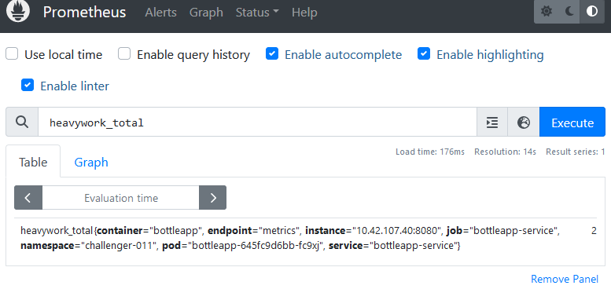
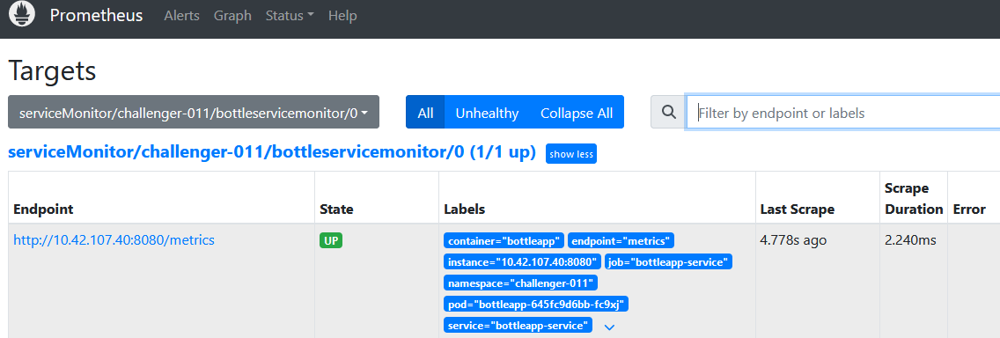

# PASO 3 DE CHALLENGE 04 : CREAR SERVICE MONITOR PARA OBTENCIÓN DE MÉTRICAS

## CONFIGURACIÓN DEL SERVICE MONITOR

Creamos el archivo "servicemonitor.yaml" con la configuración que se muestra a continuación.Notar que el selector hace match a la app: bottelapp y el puerto "metrics" que fue definido previamente en el servicio que creamos en el paso 2

```
ubuntu@ubuntu:~/challenge-4/MYCHART$ cat <<EOF > templates/servicemonitor.yaml
apiVersion: monitoring.coreos.com/v1
kind: ServiceMonitor
metadata:
  name: bottleservicemonitor
  labels:
    app: bottleapp
    release: kube-prometheus-stack
spec:
  selector:
    matchLabels:
      app: bottleapp
  endpoints:
  -  port: metrics
     interval: 5s
EOF
```

Actualizamos la aplicación usando Helm para que incluye el "service monitor"

```
ubuntu@ubuntu:~/challenge-4/MYCHART$ helm upgrade bottleapp . --namespace challenger-011
Release "bottleapp" has been upgraded. Happy Helming!
NAME: bottleapp
LAST DEPLOYED: Mon Aug  5 00:46:21 2024
NAMESPACE: challenger-011
STATUS: deployed
REVISION: 2
TEST SUITE: None
```

## VERIFICACIÓN





